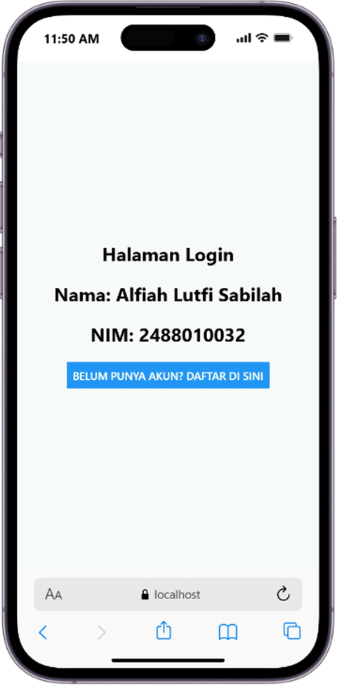
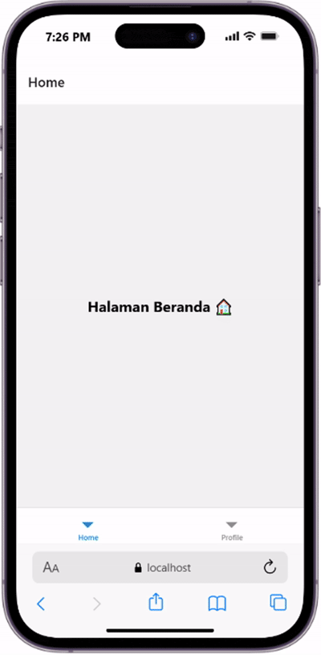
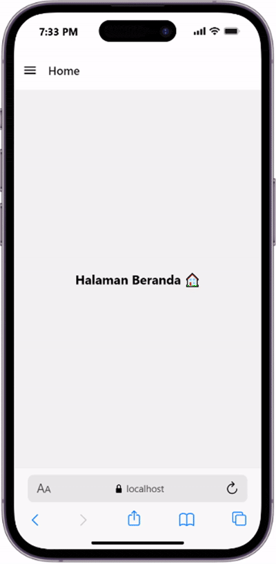

# Praktikum 4: React Native Navigation #

## Tujuan Pembelajaran #
Mahasiswa mampu:
1. Merancang dan menerapkan navigasi antar layar (screen) pada aplikasi React Native.
2. Menggunakan library React Navigation (Stack Navigator, Tab Navigator, Drawer Navigator).

## Alur Praktikum ##

## Langkah 1: Inisialisasi Proyek dan Instalasi Dependencies React Native ##
1. Buka terminal atau command prompt
2. Ubah directori ke Folder Pertemuan 4 (cd "Pemrograman Mobile\Pertemuan-4")
3. Buat proyek baru menggunakan  perintah berikut: 'npx create-expo-app ptmn4 --template blank'
4. Masuk ke dalam folder proyek menggunakan perintah berikut: 'cd ptmn4'
5. Install core navigation library (npm install @react-navigation/native)
6. Install dependensi pendukung (wajib untuk Expo)  npx expo install react-native-screens react-native-safe-area-context react-native-gesture-handler react-native-reanimated

## Langkah 2: Membuat Stack Navigator ##
1. Instalasi Pustaka Stack: 'npm install @react-navigation/native-stack'
2. Buat Folder di dalam projek dengan nama screens
3. Didalam folder screens buat 2 File dengan nama Login.js dan Signup.js
4. Masukkan kode sesuai pada Modul Praktikum 4
5. Sesuaikan file App.js dengan kode yang ada pada modul
6. Simpan dan Install depedensi untuk web "npx expo install react-dom react-native-web"
7. Jalankan perintah npx expo start --web
8. Konfirmasi Bukti

## Langkah 3 : Bottom Tab Navigation ##
1. Instalasi Pustaka Bottom Tabs 'npm install @react-navigation/bottom-tabs'
2. Buat file HomeScreen.js dan ProfileScreen.js di dalam folder screens.
3. Ubah isi App.js
4. Konfirmasi Bukti

## Langkah 4: Drawer Navigation ##
1. Instalasi Pustaka Drawer 'npm install @react-navigation/drawer' Pastikan juga plugin reanimated sudah terinstall dan dikonfigurasi di babel.config.js jika diperlukan
2. Ubah kembali file App.js untuk mencoba Drawer Navigation menggunakan layar Home dan Profile yang sudah dibuat sebelumnya
3. Konfirmasi Bukti

